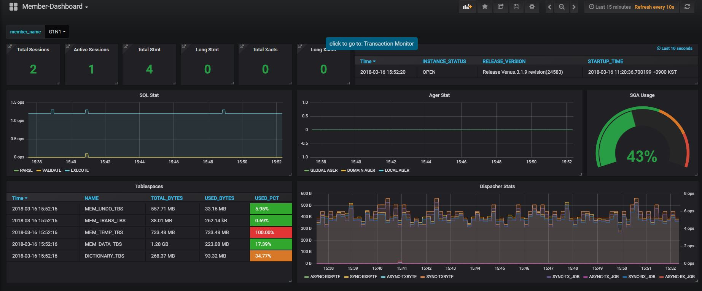

## Telegraf fork for Goldilocks Cluster 

telegraf 는 정보를 수집하여 이를 처리하여 저장소로 넘겨서 저장하는 역할을 하는 일종의 Agent 데몬 프로그램이다. 이 저장소는 오리지널 telegraf 프로그램을 fork 한 것으로, Golidlocks DBMS plugin 이 추가된 버젼이다. Goldilocks DBMS 용 Plugin 은 unixODBC 와 의존성이 있기 때문에 오리지널 telegraf 저장소에 추가할 수 없고 그래서 별도의 Fork 를 운영하게 되었다. 

다음은 본 telegraf 로 수집한 metric 을 grafana 로 꾸며본 dashboard 이다. 



Goldilock DBMS 를 telegraf 로 모니터링 하기 위해서는 이 저장소를 clone 하여 telegraf 바이너리를 만들어야한다. 본 문서는 telegraf 를 빌드하고, 수행하고, 설정하는 것에 대해서 설명할 것이다. 


## 전제조건 

* UnixODBC ( > 2.3 ) 이 필요하다. : [Get Unixodbc](http://unixodbc.org)
* Go ( > 1.9 ) 는 빌드하기 위하여 필요하다. : [Get golang](http://golang.org)


## How to Build 

1. golang이 설치되었고 적당한 $GOPATH 환경 변수가 세팅되어있는지 확인한다. 그리고 본 저장소를 통해 check out 받는다. 

```
$ go get github.com/Sibeet/telegraf
```

2. 부모디렉토리 이름을 Sibeet 이 아니라 influxdata 로 바꾼다. 이는 telegraf 내부 코드에서 internal package 를 import 하기 때문이다. 아래와 같이 바꾸지 않으면 빌드 오류가 발생한다. 

```
$ mv $GOPATH/src/github.com/Sibeet $GOPATH/src/github.com/influxdata
```
3. 빌드한다. 

```
$ cd $GOPATH/src/github.com/influxdata/telegraf 
$ make 
```

이대로 바이너리만 배포해도 되긴하지만 unixodbc 와의 의존성 및 설정 파일들때문에 복잡하게 처리를 해야하니 다음과 같이 패키징을 해서 넘기는 게 낫다. 

## 패키징 

위에서 언급했다시피 원래 telegraf 는 의존성이 전혀 없는 프로그램이지만 이 Repository 에 존재하는 telegraf 는 unixODBC 와 의존성이 있어서 배포하는 전 서버에 unixODBC 가 설치되어야 한다. 이러한 문제점을 해결하기 위해서 telegraf 패키지을 의존성을 포함해서 만들게 되면 각각의 서버에 배포할때 간편하게 배포할 수 있다. 

다음은 패키징 구조 예제이다. 

```
.
├── bin
│   └── telegraf
├── conf
│   └── telegraf.conf
├── lib
│   ├── libodbc.la
│   ├── libodbc.so
│   ├── libodbc.so.2
│   ├── libodbc.so.2.0.0
│   ├── libodbccr.la
│   ├── libodbccr.so
│   ├── libodbccr.so.2
│   ├── libodbccr.so.2.0.0
│   ├── libodbcinst.la
│   ├── libodbcinst.so
│   ├── libodbcinst.so.2
│   └── libodbcinst.so.2.0.0
├── log
│   └── telegraf.log
├── run_telegraf.sh
└── sql
    ├── init.sql
    └── telegraf_view.sql
```

위 디렉토리의 설명은 다음과 같다. 

| 이름  | 설명   |
|---|---|
| bin  |  telegraf 바이너리를 가지는 디렉토리 
| conf |  telegraf.conf 파일을 가지는 디렉토리 | 
| lib  |  unixODBC Library 들. unixODBC 의 위 파일들을 lib 디렉토리에 위치시킨다 | 
| log  |  telegraf 가 남기는 로그 파일 | 
| sql  |  telegraf Goldilocks Plugin 을 수행하기 위한 SQL 모음 | 

telegraf.conf 파일은 다음과 같이 얻을 수 있다. 

```
$ telegraf config > telegraf.conf 
```


다음은 run_telegraf script 이다. telegraf 가 혹시 비정상종료했는지 감지했다가 비정상종료하면 다시 띄워주는 Shell script 이다. 

```sh
#!/bin/bash
PWD=`pwd`
export LD_LIBRARY_PATH=$PWD/lib:$LD_LIBRARY_PATH

while [ true ]
do :
        PID=`ps -ef | grep telegraf | grep telegraf.conf | grep -v grep | awk '{print $2}'`

        if [ -z $PID ]
        then
                nohup ./bin/telegraf --config conf/telegraf.conf >> log/telegraf.log 2>&1 &
        fi

        sleep 5
done > /dev/null 2>&1 &

```
위 telegraf shell 을 수행하면 telegraf agent 를 구동할 수 있다. 

```
$ sh run_telegraf.sh 
```

아직까지 위와 같은 패키징의 자동화는 지원하지 않는다. 1회 수동으로 수행하고, 이후로는 telegraf 바이너리만 최신 버젼으로 바꿔서 나가면 되기 떄문이다. 


## Goldilocks DBMS Plugin 의 설정 

telegraf 에 대한 설정은 기존의 [Official Document](https://docs.influxdata.com/telegraf/v1.5/administration/configuration/) 가 존재한다. 본 문서에서는 Golidlocks DBMS 에 대해서만 다룬다. 

먼저 [[inputs.goldilocks]] 섹션을 찾아서 모두 주석을 해제한다. 각각의 Key 에 맞는 값을 입력한다. 

| 이름  | 설명   |
|---|---|
| goldilocks_odbc_driver_path  |  Goldilocks ODBC Driver를 지정한다. ?는 $GOLDILOCKS_HOME 을 의미하다.  
| goldilocks_host  | 모니터링할 Goldilocks 의 host 이다. 기본값은 127.0.0.1이다 | 
| goldilocks_port  | 모니터링할 Goldilocks 의 port 이다  기본값은 22581 이다 |
| goldilocks_user  | 모니터링할 Goldilocks 의 host 이다. 기본값은 test이다 | 
| goldilocks_password  | 모니터링할 Goldilocks 의 port 이다.  기본값은 test 이다|


 
## 설정 테이블 생성 

Goldilocks Plugin 은 DB 로 부터 설정값을 가지고 와서 이를 수행한다. 그렇기 때문에 다음과 같은 테이블을 생성해줘야 한다. 

```sql 
CREATE TABLE TELEGRAF_METRIC_SETTINGS
(
    SERIES_NAME  VARCHAR (100 ) PRIMARY KEY,
    QUERY        VARCHAR (4000 ) NOT NULL,
    TAGS         VARCHAR (1024 ) NULL,
    FIELDS       VARCHAR (1024 ) NULL,
    PIVOT_KEY    VARCHAR (100 ) NULL,
    PIVOT        INT NOT NULL DEFAULT 0
);

```

위 테이블의 설명은 다음과 같다. 

* SERIES_NAME : influxdb 에 저장될 series 이름이다.
* QUERY : Goldilocks 에서 수행할 Query String 이다. 
* TAGS : Query 를 수행한 결과 중 TAGS 로 사용할 Field 를 기술한다. 각각의 Tags 는  | 로 구분한다.
* FIELDS : Query 를 수행한 결과 중 FIELDS 로 사용할 Fields를 기술한다. 각각의 Fields 는 | 로 구분한다.  
* PIVOT : PIVOT 기능을 사용할지 여부를 지정한다. 1이면 사용, 0이면 미사용이다. 
* PIVOT_KEY : PIVOT 이 0 이 아닌 경우 쿼리를 수행한 결과집합의 PIVOT_KEY 컬럼의 내용을 Field 로 변환한다. Row 를 Column 으로 바꾸고 싶을때 사용한다. 역은 지원하지 않는다. 


예를 들면 다음과 같은 SQL을 통해 TELEGRAF_METRIC_SETTINGS 테이블 변경하면 

```sql
INSERT INTO TELEGRAF_METRIC_SETTINGS
SELECT 'goldilocks_tablespace_stat',
       'SELECT * FROM MONITOR_TABLESPACE_STAT',
       'GROUP_NAME|MEMBER_NAME|NAME',
       'TOTAL_BYTES|USED_BYTES|USED_PCT',
       NULL,
       0
FROM DUAL ;
```

"SELECT * FROM MONITOR_TABLESPACE_STAT" 쿼리를 수행하여 해당 결과의 GROUP_NAME, MEMBER_NAME, NAME 을 Tag 로 설정하고, TOTAL_BYTES, USED_BYTES, USED_PCT 를 Field 로 설정하는 예제이다. 


또 다른 예로 다음과 같은 SQL을 통해 TELEGRAF_METRIC_SETTINGS 테이블 변경하면 

```sql
INSERT INTO TELEGRAF_METRIC_SETTINGS
SELECT 'goldilocks_sql_stat',
       'SELECT * FROM MONITOR_SQL_STAT',
       'GROUP_NAME|MEMBER_NAME',
       'STAT_VALUE',
       'STAT_NAME',
       1
FROM DUAL ;
```

"SELECT * FROM MONITOR_SQL_STAT" 쿼리를 수행하여 해당 결과의 GROUP_NAME, MEMBER_NAME 은 TAG 로 설정하고, STAT_NAME 컬럼에 나오는 값을 Field 로 변환하여 STAT_VALUE 를 해당 값에 세팅한다는 의미이다. Row 를 Column 형태로 바꾸는 것으로 이해하면 된다. 

## Monitoring View 및 미리 설정된 Metrics 

$GOPATH/github.com/ckh0618/telegraf/plugins/inputs/goldilocks_cluster 디렉토리에서 다음과 같이 두개의 View 를 찾을 수 있다. 

* MonitoringView_CLUSTER.sql : 모니터링 뷰 
* InitData_CLUSTER.sql : TELEGRAF_METRIC_SETTINGS 에 저장하는 기본 Metric 데이터 


